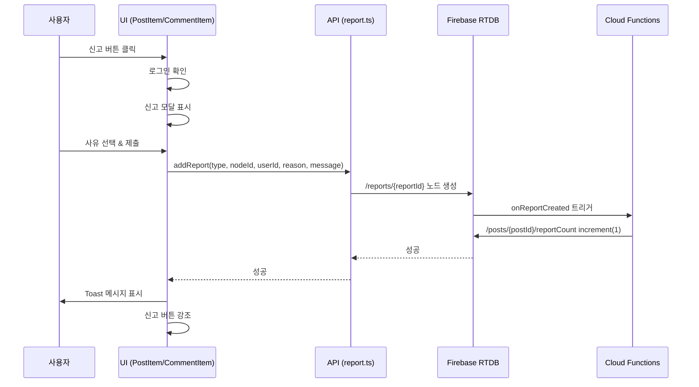
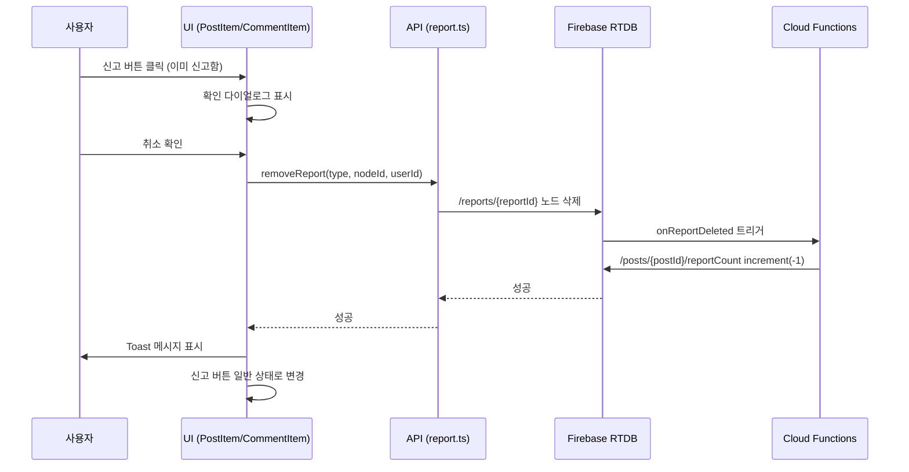

# 신고 기능 개발 가이드

## 목차

- [신고 기능 개발 가이드](#신고-기능-개발-가이드)
  - [목차](#목차)
  - [Overview](#overview)
  - [Requirements](#requirements)
  - [Workflow](#workflow)
  - [Detail Items](#detail-items)
    - [1. 데이터베이스 구조](#1-데이터베이스-구조)
      - [신고 데이터 (reports)](#신고-데이터-reports)
      - [신고 카운터 필드](#신고-카운터-필드)
      - [데이터 예시](#데이터-예시)
      - [키 형식 규칙](#키-형식-규칙)
      - [클라이언트/서버 역할 분리](#클라이언트서버-역할-분리)
    - [2. 신고 사유 (Reason Types)](#2-신고-사유-reason-types)
    - [3. 클라이언트 API 함수 사양](#3-클라이언트-api-함수-사양)
      - [파일 위치](#파일-위치)
      - [함수 목록](#함수-목록)
      - [addReport() 함수](#addreport-함수)
      - [removeReport() 함수](#removereport-함수)
      - [checkReportStatus() 함수](#checkreportstatus-함수)
      - [getReportCount() 함수](#getreportcount-함수)
    - [4. UI/UX 사양](#4-uiux-사양)
      - [게시글 신고 버튼 (PostItem.svelte)](#게시글-신고-버튼-postitemsvelte)
      - [댓글 신고 버튼 (CommentItem.svelte)](#댓글-신고-버튼-commentitemsvelte)
      - [신고 모달 다이얼로그](#신고-모달-다이얼로그)
      - [신고 버튼 강조 표시](#신고-버튼-강조-표시)
    - [5. 관리자 신고 목록 페이지](#5-관리자-신고-목록-페이지)
      - [경로](#경로)
      - [파일 위치](#파일-위치-1)
      - [UI 구조](#ui-구조)
      - [구현 세부사항](#구현-세부사항)
    - [6. 사용자 신고 목록 페이지](#6-사용자-신고-목록-페이지)
      - [경로](#경로-1)
      - [파일 위치](#파일-위치-2)
      - [기능 설명](#기능-설명)
      - [UI 구조](#ui-구조-1)
    - [7. 라우팅 및 메뉴 설정](#7-라우팅-및-메뉴-설정)
      - [App.svelte 라우팅](#appsvelte-라우팅)
      - [Menu.svelte 메뉴 항목](#menusvelte-메뉴-항목)
    - [8. Cloud Functions 사양](#8-cloud-functions-사양)
      - [파일 위치](#파일-위치-3)
      - [onReportCreated 트리거](#onreportcreated-트리거)
      - [onReportDeleted 트리거](#onreportdeleted-트리거)
    - [9. Firebase 보안 규칙](#9-firebase-보안-규칙)
      - [신고 노드 (/reports/)](#신고-노드-reports)
      - [카운터 필드 (reportCount)](#카운터-필드-reportcount)
    - [10. 다국어 지원 (i18n)](#10-다국어-지원-i18n)
      - [한국어 (ko.json)](#한국어-kojson)
      - [영어 (en.json)](#영어-enjson)
      - [일본어 (ja.json)](#일본어-jajson)
      - [중국어 (zh.json)](#중국어-zhjson)
    - [11. 테스트 사양](#11-테스트-사양)
      - [유닛 테스트](#유닛-테스트)
      - [통합 테스트](#통합-테스트)
      - [E2E 테스트](#e2e-테스트)
  - [워크플로우 및 설계 원칙](#워크플로우-및-설계-원칙)
    - [신고 추가 플로우](#신고-추가-플로우)
    - [신고 취소 플로우](#신고-취소-플로우)
    - [중복 신고 방지 원칙](#중복-신고-방지-원칙)
    - [클라이언트와 백엔드의 역할 구분](#클라이언트와-백엔드의-역할-구분)
  - [관련 가이드 문서](#관련-가이드-문서)
  - [참고 자료](#참고-자료)

---

## Overview

신고(Report) 기능은 사용자가 부적절한 게시글 또는 댓글을 신고하여 관리자가 확인하고 조치를 취할 수 있도록 하는 기능입니다.

**핵심 특징:**
- ✅ 로그인한 사용자만 신고 가능
- ✅ 5가지 신고 사유 선택 (욕설, 가짜 뉴스, 스팸, 부적절한 카테고리, 기타)
- ✅ 중복 신고 방지 (동일 사용자가 같은 게시글/댓글을 중복 신고 불가)
- ✅ Firebase Realtime Database에 Flat Style 구조로 저장
- ✅ Cloud Functions에서 reportCount 자동 관리
- ✅ 관리자 대시보드 (`/admin/reports`)에서 모든 신고 내역 확인
- ✅ 사용자 대시보드 (`/my/reports`)에서 내 신고 내역 확인 및 취소 가능
- ✅ 신고한 게시글/댓글의 버튼 강조 표시

---

## Requirements

**필수 라이브러리 및 도구:**
- ✅ Firebase Realtime Database (RTDB)
- ✅ Firebase Cloud Functions (Node.js)
- ✅ Svelte 5 (버전: `svelte@5.43.2`)
- ✅ lucide-svelte (아이콘 라이브러리)
- ✅ Firebase Authentication (로그인 필수)

**선행 조건:**
- ✅ Firebase 프로젝트 설정 완료
- ✅ Firebase Authentication 활성화
- ✅ Realtime Database 생성 완료
- ✅ Cloud Functions 배포 환경 구성 완료

---

## Workflow

신고 기능 개발은 다음 순서로 진행해야 합니다:

1. **데이터베이스 구조 정의**
   - `/reports/` 노드 구조 설계
   - `/posts/{postId}/reportCount`, `/comments/{commentId}/reportCount` 필드 추가
   - 키 형식 규칙 정의 (`post-{postId}-{uid}`, `comment-{commentId}-{uid}`)

2. **클라이언트 API 함수 작성**
   - `src/lib/services/report.ts` 파일 생성
   - `addReport()`, `removeReport()`, `checkReportStatus()`, `getReportCount()` 함수 구현

3. **UI 컴포넌트 수정**
   - `PostItem.svelte`: 신고 버튼에 `onclick` 핸들러 추가
   - `CommentItem.svelte`: 신고 버튼 추가
   - 신고 모달 다이얼로그 구현 (사유 선택 UI)

4. **관리자 신고 목록 페이지 작성**
   - `src/demo/AdminReportListPage.svelte` 파일 생성
   - DatabaseListView로 모든 신고 목록 렌더링

5. **사용자 신고 목록 페이지 작성**
   - `src/demo/MyReportListPage.svelte` 파일 생성
   - DatabaseListView로 내 신고 목록 렌더링 (uid 필터링)
   - 신고 취소 기능 추가

6. **라우팅 및 메뉴 설정**
   - `App.svelte`에 `/admin/reports`, `/my/reports` 경로 추가
   - `Menu.svelte`에 메뉴 항목 추가

7. **Cloud Functions 트리거 작성**
   - `firebase/functions/src/handlers/report.handler.ts` 파일 생성
   - `onReportCreated`: 신고 추가 시 reportCount 증가
   - `onReportDeleted`: 신고 삭제 시 reportCount 감소

8. **Firebase 보안 규칙 추가**
   - `/reports/` 노드 읽기/쓰기 권한 설정
   - `reportCount` 필드 읽기 전용 설정

9. **다국어 지원 추가**
   - `ko.json`, `en.json`, `ja.json`, `zh.json`에 번역 추가
   - 신고 관련 키 추가: `내_신고_목록`, `관리자_신고_목록`, `대상_보기`, `신고를취소하시겠습니까` 등

10. **테스트**
   - 신고 추가/취소 테스트
   - 중복 신고 방지 테스트
   - reportCount 자동 증감 테스트
   - 관리자 대시보드 테스트

---

## Detail Items

### 1. 데이터베이스 구조

**📚 데이터베이스 구조는 [specs/snsweb-firebase-database.md](./snsweb-firebase-database.md)의 "신고 (reports)" 섹션을 참조하세요.**

#### 핵심 포인트

신고 기능의 데이터베이스 구조 개요:

- **경로**: `/reports/` (단일 레벨 Flat Style 구조)
- **키 형식**: `{type}-{nodeId}-{uid}` (예: `post-abc123-user456`, `comment-xyz789-user789`)
- **신고 사유**: 5가지 타입 (`abuse`, `fake-news`, `spam`, `inappropriate`, `other`)
- **reportCount**: 각 게시글/댓글에 자동으로 관리되는 신고 개수 필드
- **중복 방지**: 동일한 사용자는 동일한 게시글/댓글을 중복 신고할 수 없음
- **역할 분리**:
  - 클라이언트: `/reports/{reportId}` 노드 생성/삭제
  - 서버 (Cloud Functions): `reportCount` 자동 증감 관리

**📖 상세 내용**:
- 전체 데이터 구조 및 필드 설명: [snsweb-firebase-database.md - 신고 (reports)](./snsweb-firebase-database.md#신고-reports)
- 게시글/댓글 구조: [snsweb-firebase-database.md - 게시글 (posts)](./snsweb-firebase-database.md#게시글-posts), [댓글 (comments)](./snsweb-firebase-database.md#댓글-comments)

---

### 2. 신고 사유 (Reason Types)

사용자는 다음 5가지 신고 사유 중 하나를 선택해야 합니다:

| 코드 | 한국어 설명 | 영어 설명 |
|------|------------|----------|
| `abuse` | 욕설, 시비, 모욕, 명예훼손 | Abuse, Harassment, Defamation |
| `fake-news` | 가짜 뉴스, 잘못된 정보 | Fake News, Misinformation |
| `spam` | 스팸, 악용 | Spam, Abuse |
| `inappropriate` | 카테고리에 맞지 않는 글 등록 | Inappropriate Category |
| `other` | 기타 | Other |

**상수 정의 (TypeScript):**
```typescript
export const REPORT_REASONS = {
  ABUSE: 'abuse',
  FAKE_NEWS: 'fake-news',
  SPAM: 'spam',
  INAPPROPRIATE: 'inappropriate',
  OTHER: 'other'
} as const;

export type ReportReason = typeof REPORT_REASONS[keyof typeof REPORT_REASONS];
```

---

### 3. 클라이언트 API 함수 사양

#### 파일 위치

**경로:** `src/lib/services/report.ts`

#### 함수 목록

1. `addReport(type, nodeId, userId, reason, message)` - 신고 추가
2. `removeReport(type, nodeId, userId)` - 신고 취소
3. `checkReportStatus(type, nodeId, userId)` - 신고 여부 확인
4. `getReportCount(type, nodeId)` - 신고 개수 조회

---

#### addReport() 함수

**역할:** 신고를 추가합니다.

**함수 시그니처:**
```typescript
export async function addReport(
  type: 'post' | 'comment',
  nodeId: string,
  userId: string,
  reason: ReportReason,
  message: string = ''
): Promise<void>
```

**파라미터:**
- `type` (string): `'post'` 또는 `'comment'`
- `nodeId` (string): 게시글 ID 또는 댓글 ID
- `userId` (string): 신고자 사용자 UID
- `reason` (ReportReason): 신고 사유 (`'abuse'`, `'fake-news'`, `'spam'`, `'inappropriate'`, `'other'`)
- `message` (string, 선택): 상세 설명 (기본값: 빈 문자열)

**리턴값:** `Promise<void>` (에러 발생 시 throw)

**구현 예제:**
```typescript
import { ref, update } from 'firebase/database';
import { database } from '../firebase';

export async function addReport(
  type: 'post' | 'comment',
  nodeId: string,
  userId: string,
  reason: ReportReason,
  message: string = ''
): Promise<void> {
  // nodeId 앞의 하이픈 제거 (Firebase push key는 '-'로 시작)
  const cleanNodeId = nodeId.startsWith('-') ? nodeId.substring(1) : nodeId;

  // 신고 키 생성
  const reportKey = `${type}-${cleanNodeId}-${userId}`;

  // 신고 데이터 생성
  const reportData = {
    type,
    nodeId: cleanNodeId,
    uid: userId,
    reason,
    message,
    createdAt: Date.now()
  };

  // RTDB에 저장
  const updates = {};
  updates[`reports/${reportKey}`] = reportData;

  await update(ref(database), updates);
}
```

**에러 처리:**
- ✅ `type`이 `'post'` 또는 `'comment'`가 아닌 경우 에러
- ✅ `nodeId`, `userId`, `reason`이 비어있는 경우 에러
- ✅ `reason`이 정의되지 않은 사유인 경우 에러
- ✅ Firebase 연결 실패 시 에러

---

#### removeReport() 함수

**역할:** 신고를 취소합니다.

**함수 시그니처:**
```typescript
export async function removeReport(
  type: 'post' | 'comment',
  nodeId: string,
  userId: string
): Promise<void>
```

**파라미터:**
- `type` (string): `'post'` 또는 `'comment'`
- `nodeId` (string): 게시글 ID 또는 댓글 ID
- `userId` (string): 신고자 사용자 UID

**리턴값:** `Promise<void>` (에러 발생 시 throw)

**구현 예제:**
```typescript
import { ref, remove } from 'firebase/database';
import { database } from '../firebase';

export async function removeReport(
  type: 'post' | 'comment',
  nodeId: string,
  userId: string
): Promise<void> {
  const cleanNodeId = nodeId.startsWith('-') ? nodeId.substring(1) : nodeId;
  const reportKey = `${type}-${cleanNodeId}-${userId}`;

  await remove(ref(database, `reports/${reportKey}`));
}
```

---

#### checkReportStatus() 함수

**역할:** 사용자가 특정 게시글/댓글을 이미 신고했는지 확인합니다.

**함수 시그니처:**
```typescript
export async function checkReportStatus(
  type: 'post' | 'comment',
  nodeId: string,
  userId: string
): Promise<boolean>
```

**파라미터:**
- `type` (string): `'post'` 또는 `'comment'`
- `nodeId` (string): 게시글 ID 또는 댓글 ID
- `userId` (string): 사용자 UID

**리턴값:** `Promise<boolean>` - 신고한 경우 `true`, 아닌 경우 `false`

**구현 예제:**
```typescript
import { ref, get } from 'firebase/database';
import { database } from '../firebase';

export async function checkReportStatus(
  type: 'post' | 'comment',
  nodeId: string,
  userId: string
): Promise<boolean> {
  const cleanNodeId = nodeId.startsWith('-') ? nodeId.substring(1) : nodeId;
  const reportKey = `${type}-${cleanNodeId}-${userId}`;

  const snapshot = await get(ref(database, `reports/${reportKey}`));
  return snapshot.exists();
}
```

---

#### getReportCount() 함수

**역할:** 특정 게시글/댓글의 신고 개수를 조회합니다.

**함수 시그니처:**
```typescript
export async function getReportCount(
  type: 'post' | 'comment',
  nodeId: string
): Promise<number>
```

**파라미터:**
- `type` (string): `'post'` 또는 `'comment'`
- `nodeId` (string): 게시글 ID 또는 댓글 ID

**리턴값:** `Promise<number>` - 신고 개수

**구현 예제:**
```typescript
import { ref, get } from 'firebase/database';
import { database } from '../firebase';

export async function getReportCount(
  type: 'post' | 'comment',
  nodeId: string
): Promise<number> {
  const cleanNodeId = nodeId.startsWith('-') ? nodeId.substring(1) : nodeId;

  const path = type === 'post'
    ? `posts/${cleanNodeId}/reportCount`
    : `comments/${cleanNodeId}/reportCount`;

  const snapshot = await get(ref(database, path));
  return snapshot.val() || 0;
}
```

---

### 4. UI/UX 사양

#### 게시글 신고 버튼 (PostItem.svelte)

**파일 위치:** `src/demo/PostItem.svelte`

**라인 번호:** 530줄 (기존 신고 버튼 위치)

**수정 내용:**

**기존 코드 (라인 530):**
```svelte
<button class="action-btn" title={$t("신고")}>
  <span class="icon">🚨</span>
  {$t("신고")}
</button>
```

**수정 후 코드:**
```svelte
<button
  class="action-btn {isReported ? 'reported' : ''}"
  title={$t("신고")}
  onclick={handleReportClick}
>
  <span class="icon">🚨</span>
  {$t("신고")}
</button>
```

**추가할 스크립트:**
```typescript
import { addReport, removeReport, checkReportStatus } from '../lib/services/report';

let isReported = $state(false);
let showReportModal = $state(false);

// 컴포넌트 마운트 시 신고 상태 확인
onMount(async () => {
  if (userId && itemData.postId) {
    isReported = await checkReportStatus('post', itemData.postId, userId);
  }
});

// 신고 버튼 클릭 핸들러
async function handleReportClick() {
  if (!userId) {
    showToast($t('로그인후이용'));
    return;
  }

  if (isReported) {
    // 이미 신고한 경우 취소
    const confirmed = confirm($t('신고를취소하시겠습니까'));
    if (confirmed) {
      await removeReport('post', itemData.postId, userId);
      isReported = false;
      showToast($t('신고취소완료'));
    }
  } else {
    // 신고 모달 표시
    showReportModal = true;
  }
}

// 신고 제출 핸들러
async function handleReportSubmit(reason: string, message: string) {
  try {
    await addReport('post', itemData.postId, userId, reason, message);
    isReported = true;
    showReportModal = false;
    showToast($t('신고완료'));
  } catch (error) {
    console.error('신고 실패:', error);
    showToast($t('신고실패'));
  }
}
```

**추가할 스타일:**
```css
.action-btn.reported {
  background-color: #fef2f2;
  border-color: #fca5a5;
  color: #dc2626;
}

.action-btn.reported:hover {
  background-color: #fee2e2;
  border-color: #f87171;
}
```

---

#### 댓글 신고 버튼 (CommentItem.svelte)

**파일 위치:** `src/demo/CommentItem.svelte`

**추가 위치:** 답글 버튼 다음 (라인 397-446 영역)

**추가할 코드:**
```svelte
<!-- 신고 버튼 -->
{#if userId}
  <button
    class="action-button report-button {isReported ? 'reported' : ''}"
    onclick={handleReportClick}
  >
    <span class="emoji">🚨</span>
    <span class="text">{$t("신고")}</span>
  </button>
{/if}
```

**추가할 스크립트 (PostItem과 동일):**
```typescript
import { addReport, removeReport, checkReportStatus } from '../lib/services/report';

let isReported = $state(false);
let showReportModal = $state(false);

onMount(async () => {
  if (userId && comment.commentId) {
    isReported = await checkReportStatus('comment', comment.commentId, userId);
  }
});

async function handleReportClick() {
  if (!userId) {
    showToast($t('로그인후이용'));
    return;
  }

  if (isReported) {
    const confirmed = confirm($t('신고를취소하시겠습니까'));
    if (confirmed) {
      await removeReport('comment', comment.commentId, userId);
      isReported = false;
      showToast($t('신고취소완료'));
    }
  } else {
    showReportModal = true;
  }
}

async function handleReportSubmit(reason: string, message: string) {
  try {
    await addReport('comment', comment.commentId, userId, reason, message);
    isReported = true;
    showReportModal = false;
    showToast($t('신고완료'));
  } catch (error) {
    console.error('신고 실패:', error);
    showToast($t('신고실패'));
  }
}
```

---

#### 신고 모달 다이얼로그

**컴포넌트 이름:** `ReportModal.svelte`

**파일 위치:** `src/lib/components/ReportModal.svelte`

**Props:**
- `show` (boolean): 모달 표시 여부
- `onSubmit` (function): 신고 제출 콜백 `(reason: string, message: string) => void`
- `onCancel` (function): 취소 콜백 `() => void`

**UI 구조:**
```svelte
<script>
  import { t } from '../stores/i18n';

  let {
    show = $bindable(false),
    onSubmit = () => {},
    onCancel = () => {}
  } = $props();

  let selectedReason = $state('');
  let message = $state('');

  const reasons = [
    { value: 'abuse', label: $t('신고사유_욕설') },
    { value: 'fake-news', label: $t('신고사유_가짜뉴스') },
    { value: 'spam', label: $t('신고사유_스팸') },
    { value: 'inappropriate', label: $t('신고사유_부적절') },
    { value: 'other', label: $t('신고사유_기타') }
  ];

  function handleSubmit() {
    if (!selectedReason) {
      alert($t('신고사유를선택하세요'));
      return;
    }
    onSubmit(selectedReason, message);
    resetForm();
  }

  function handleCancel() {
    onCancel();
    resetForm();
  }

  function resetForm() {
    selectedReason = '';
    message = '';
  }
</script>

{#if show}
  <div class="modal-overlay" onclick={handleCancel}>
    <div class="modal-content" onclick={(e) => e.stopPropagation()}>
      <h2 class="modal-title">{$t('신고하기')}</h2>

      <div class="reason-list">
        <label class="label">{$t('신고사유선택')}</label>
        {#each reasons as reason}
          <label class="reason-item">
            <input
              type="radio"
              name="reason"
              value={reason.value}
              bind:group={selectedReason}
            />
            <span>{reason.label}</span>
          </label>
        {/each}
      </div>

      <div class="message-field">
        <label class="label">{$t('신고상세메시지')}</label>
        <textarea
          bind:value={message}
          placeholder={$t('상세내용을입력하세요')}
          rows="4"
        ></textarea>
      </div>

      <div class="modal-actions">
        <button class="cancel-btn" onclick={handleCancel}>
          {$t('취소')}
        </button>
        <button class="submit-btn" onclick={handleSubmit}>
          {$t('신고하기')}
        </button>
      </div>
    </div>
  </div>
{/if}

<style>
  .modal-overlay {
    position: fixed;
    top: 0;
    left: 0;
    right: 0;
    bottom: 0;
    background-color: rgba(0, 0, 0, 0.5);
    display: flex;
    align-items: center;
    justify-content: center;
    z-index: 1000;
  }

  .modal-content {
    background-color: white;
    border-radius: 0.5rem;
    padding: 2rem;
    max-width: 500px;
    width: 90%;
    max-height: 80vh;
    overflow-y: auto;
  }

  .modal-title {
    margin: 0 0 1.5rem 0;
    font-size: 1.5rem;
    font-weight: 700;
    color: #111827;
  }

  .label {
    display: block;
    margin-bottom: 0.5rem;
    font-weight: 600;
    color: #374151;
  }

  .reason-list {
    margin-bottom: 1.5rem;
  }

  .reason-item {
    display: flex;
    align-items: center;
    padding: 0.75rem;
    margin-bottom: 0.5rem;
    border: 1px solid #e5e7eb;
    border-radius: 0.375rem;
    cursor: pointer;
    transition: background-color 0.2s;
  }

  .reason-item:hover {
    background-color: #f9fafb;
  }

  .reason-item input[type="radio"] {
    margin-right: 0.75rem;
  }

  .message-field {
    margin-bottom: 1.5rem;
  }

  textarea {
    width: 100%;
    padding: 0.75rem;
    border: 1px solid #d1d5db;
    border-radius: 0.375rem;
    font-size: 0.95rem;
    resize: vertical;
  }

  textarea:focus {
    outline: none;
    border-color: #3b82f6;
  }

  .modal-actions {
    display: flex;
    gap: 1rem;
    justify-content: flex-end;
  }

  .cancel-btn,
  .submit-btn {
    padding: 0.75rem 1.5rem;
    border-radius: 0.375rem;
    font-weight: 500;
    cursor: pointer;
    transition: background-color 0.2s;
  }

  .cancel-btn {
    background-color: #f3f4f6;
    border: 1px solid #d1d5db;
    color: #374151;
  }

  .cancel-btn:hover {
    background-color: #e5e7eb;
  }

  .submit-btn {
    background-color: #ef4444;
    border: none;
    color: white;
  }

  .submit-btn:hover {
    background-color: #dc2626;
  }
</style>
```

---

#### 신고 버튼 강조 표시

신고한 게시글/댓글의 버튼은 시각적으로 강조 표시됩니다.

**강조 상태 (isReported = true):**
- 배경색: `#fef2f2` (연한 빨강)
- 테두리: `#fca5a5` (빨강)
- 텍스트 색상: `#dc2626` (진한 빨강)
- 아이콘: 🚨 (동일)

**일반 상태 (isReported = false):**
- 배경색: 투명 또는 기본 배경
- 테두리: 기본 테두리
- 텍스트 색상: 기본 색상

---

### 5. 관리자 신고 목록 페이지

#### 경로

**URL:** `/admin/reports`

#### 파일 위치

**파일명:** `src/demo/AdminReportListPage.svelte`

#### UI 구조

```svelte
<script>
  import { onMount } from 'svelte';
  import { t } from '../lib/stores/i18n';
  import { setPageTitle } from '../lib/stores/pageTitle';
  import DatabaseListView from '../lib/components/DatabaseListView.svelte';

  onMount(() => {
    setPageTitle($t('신고관리'));
  });
</script>

<div class="admin-report-container">
  <h1 class="page-title">{$t('신고관리')}</h1>

  <DatabaseListView
    path="reports"
    orderBy="createdAt"
    reverse={true}
    pageSize={20}
  >
    {#snippet item(rawItemData, index)}
      <div class="report-item">
        <div class="report-header">
          <span class="report-type">
            {rawItemData.data.type === 'post' ? '📝 게시글' : '💬 댓글'}
          </span>
          <span class="report-time">
            {new Date(rawItemData.data.createdAt).toLocaleString()}
          </span>
        </div>

        <div class="report-body">
          <div class="report-reason">
            <strong>{$t('신고사유')}:</strong>
            {$t(`신고사유_${rawItemData.data.reason}`)}
          </div>

          {#if rawItemData.data.message}
            <div class="report-message">
              <strong>{$t('상세내용')}:</strong>
              {rawItemData.data.message}
            </div>
          {/if}

          <div class="report-info">
            <span><strong>{$t('신고자')}:</strong> {rawItemData.data.uid}</span>
            <span><strong>{$t('대상ID')}:</strong> {rawItemData.data.nodeId}</span>
          </div>
        </div>

        <div class="report-actions">
          <button class="view-btn">
            {$t('원본보기')}
          </button>
          <button class="resolve-btn">
            {$t('처리완료')}
          </button>
          <button class="dismiss-btn">
            {$t('기각')}
          </button>
        </div>
      </div>
    {/snippet}

    {#snippet empty()}
      <div class="empty-state">
        {$t('신고내역없음')}
      </div>
    {/snippet}
  </DatabaseListView>
</div>

<style>
  .admin-report-container {
    max-width: 1200px;
    margin: 0 auto;
    padding: 2rem;
  }

  .page-title {
    font-size: 2rem;
    font-weight: 700;
    margin-bottom: 2rem;
    color: #111827;
  }

  .report-item {
    background-color: white;
    border: 1px solid #e5e7eb;
    border-radius: 0.5rem;
    padding: 1.5rem;
    margin-bottom: 1rem;
  }

  .report-header {
    display: flex;
    justify-content: space-between;
    align-items: center;
    margin-bottom: 1rem;
    padding-bottom: 1rem;
    border-bottom: 1px solid #e5e7eb;
  }

  .report-type {
    font-size: 1.1rem;
    font-weight: 600;
  }

  .report-time {
    color: #6b7280;
    font-size: 0.875rem;
  }

  .report-body {
    margin-bottom: 1rem;
  }

  .report-reason,
  .report-message {
    margin-bottom: 0.75rem;
    line-height: 1.6;
  }

  .report-info {
    display: flex;
    gap: 1.5rem;
    color: #6b7280;
    font-size: 0.875rem;
  }

  .report-actions {
    display: flex;
    gap: 0.75rem;
  }

  .view-btn,
  .resolve-btn,
  .dismiss-btn {
    padding: 0.5rem 1rem;
    border-radius: 0.375rem;
    font-size: 0.875rem;
    font-weight: 500;
    cursor: pointer;
    transition: all 0.2s;
  }

  .view-btn {
    background-color: #3b82f6;
    border: none;
    color: white;
  }

  .view-btn:hover {
    background-color: #2563eb;
  }

  .resolve-btn {
    background-color: #10b981;
    border: none;
    color: white;
  }

  .resolve-btn:hover {
    background-color: #059669;
  }

  .dismiss-btn {
    background-color: #f3f4f6;
    border: 1px solid #d1d5db;
    color: #374151;
  }

  .dismiss-btn:hover {
    background-color: #e5e7eb;
  }

  .empty-state {
    text-align: center;
    padding: 4rem 2rem;
    color: #6b7280;
    font-size: 1.1rem;
  }
</style>
```

#### 구현 세부사항

1. **DatabaseListView 활용**:
   - `path="reports"`: 모든 신고 조회
   - `orderBy="createdAt"`: 생성 시간 기준 정렬
   - `reverse={true}`: 최신 신고가 먼저 표시
   - `pageSize={20}`: 한 페이지에 20개 표시

2. **신고 아이템 표시**:
   - 신고 타입 (게시글/댓글)
   - 신고 시간
   - 신고 사유
   - 상세 메시지 (선택 사항)
   - 신고자 UID
   - 대상 노드 ID

3. **액션 버튼**:
   - **원본 보기**: 신고된 게시글/댓글로 이동
   - **처리 완료**: 신고 승인 (콘텐츠 삭제 등)
   - **기각**: 신고 기각 (신고만 삭제)

---

### 6. 사용자 신고 목록 페이지

#### 경로

**URL:** `/my/reports`

#### 파일 위치

**파일명:** `src/demo/MyReportListPage.svelte`

#### 기능 설명

사용자 신고 목록 페이지는 현재 로그인한 사용자가 작성한 신고 내역만 표시하며, 다음 기능을 제공합니다:

- ✅ **로그인 필수**: 로그인하지 않은 경우 로그인 버튼이 포함된 빈 상태 표시
- ✅ **내 신고 필터링**: DatabaseListView의 `filter` prop을 사용하여 `uid`로 클라이언트 측 필터링
- ✅ **신고 취소 기능**: 각 신고 아이템에 "신고_취소" 버튼 제공
- ✅ **대상 보기**: 신고한 게시글/댓글로 이동하는 "대상_보기" 버튼 제공
- ✅ **실시간 업데이트**: 신고를 취소하면 목록에서 자동으로 제거

#### UI 구조

**주요 컴포넌트:**

```svelte
<script lang="ts">
  import { t } from "../lib/stores/i18n";
  import { user } from "../lib/stores/user";
  import DatabaseListView from "../lib/components/DatabaseListView.svelte";
  import type { ReportWithId } from "../lib/types/report";
  import { navigate } from "../lib/utils/navigate";
  import { removeReport } from "../lib/services/report";
  import { showToast } from "../lib/stores/toast";

  // 게시글/댓글로 이동하는 함수
  function handleGoToNode(report: ReportWithId) {
    if (report.type === "post") {
      navigate(`/post/detail/${report.nodeId}`);
    } else {
      navigate("/post/list");
    }
  }

  // 신고 취소 핸들러
  async function handleCancelReport(report: ReportWithId) {
    if (!confirm($t("신고를취소하시겠습니까"))) return;

    if (!$user) {
      showToast($t("로그인필요"), "error");
      return;
    }

    try {
      const result = await removeReport(report.type, report.nodeId, $user.uid);
      if (result.success) {
        showToast($t("신고가취소되었습니다"), "success");
      } else {
        showToast($t(result.error || "error.unknown"), "error");
      }
    } catch (error) {
      console.error("신고 취소 오류:", error);
      showToast($t("error.unknown"), "error");
    }
  }
</script>

{#if !$user}
  <!-- 로그인하지 않은 경우 -->
  <div class="empty-state">
    <p>{$t("로그인필요")}</p>
    <button class="login-btn" onclick={() => navigate("/user/login")}>
      {$t("로그인")}
    </button>
  </div>
{:else}
  <!-- 로그인한 경우 -->
  <DatabaseListView
    path="reports"
    orderBy="createdAt"
    limitToFirst={20}
    filter={(item) => item.uid === $user?.uid}
    let:item
    let:index
  >
    {@const report = item as ReportWithId}
    <div class="report-item">
      <!-- 신고 헤더 -->
      <div class="report-header">
        <span class="report-number">#{index + 1}</span>
        <span class="report-type {report.type}">{getTypeText(report.type)}</span>
        <span class="report-date">
          {new Date(report.createdAt).toLocaleDateString("ko-KR")}
        </span>
      </div>

      <!-- 신고 내용 -->
      <div class="report-content">
        <div class="report-info-row">
          <span class="label">{$t("대상ID")}:</span>
          <span class="value">{report.nodeId}</span>
        </div>
        <div class="report-info-row">
          <span class="label">{$t("신고사유")}:</span>
          <span class="value reason">{getReasonText(report.reason)}</span>
        </div>
        {#if report.message}
          <div class="report-info-row">
            <span class="label">{$t("상세메시지")}:</span>
            <span class="value message">{report.message}</span>
          </div>
        {/if}
      </div>

      <!-- 액션 버튼 -->
      <div class="report-actions">
        <button class="action-btn go-to-node" onclick={() => handleGoToNode(report)}>
          {$t("대상_보기")}
        </button>
        <button class="action-btn cancel-report" onclick={() => handleCancelReport(report)}>
          {$t("신고_취소")}
        </button>
      </div>
    </div>
  </DatabaseListView>
{/if}
```

**주요 기능:**

1. **로그인 체크**: `$user` 스토어를 사용하여 로그인 상태 확인
2. **클라이언트 필터링**: `filter={(item) => item.uid === $user?.uid}`로 내 신고만 표시
3. **신고 취소**: `removeReport()` 함수 호출 후 Toast 메시지 표시
4. **대상 보기**: 게시글은 `/post/detail/{nodeId}`로, 댓글은 `/post/list`로 이동
5. **확인 다이얼로그**: `confirm()`으로 취소 확인

---

### 7. 라우팅 및 메뉴 설정

#### App.svelte 라우팅

**파일 위치:** `src/demo/App.svelte`

**추가할 import:**
```typescript
import AdminReportListPage from "./AdminReportListPage.svelte";
import MyReportListPage from "./MyReportListPage.svelte";
```

**추가할 라우트:**
```svelte
{:else if currentPath === "/admin/reports"}
  <!-- 관리자 신고 목록 페이지 -->
  <AdminReportListPage />
{:else if currentPath === "/my/reports"}
  <!-- 내 신고 목록 페이지 -->
  <MyReportListPage />
```

**위치:** `/admin` 라우트 다음, `/about` 라우트 이전에 추가

#### Menu.svelte 메뉴 항목

**파일 위치:** `src/demo/Menu.svelte`

**추가할 메뉴 항목:**
```svelte
let menuItems = $derived([
  // ... 기존 항목들
  { label: $t('관리자'), path: '/admin' },
  { label: $t('관리자_신고_목록'), path: '/admin/reports' },
  { label: $t('내_신고_목록'), path: '/my/reports' },
  // ... 나머지 항목들
]);
```

**i18n 키:**
- `관리자_신고_목록`: "관리자 신고 목록" (ko), "Admin Report List" (en), "管理者通報リスト" (ja), "管理员举报列表" (zh)
- `내_신고_목록`: "내 신고 목록" (ko), "My Reports" (en), "私の通報リスト" (ja), "我的举报列表" (zh)

**주의사항:**
- ✅ 관리자 메뉴 (`/admin/reports`)는 모든 사용자에게 표시되지만, Firebase 보안 규칙에서 관리자만 접근 가능하도록 제한
- ✅ 사용자 메뉴 (`/my/reports`)는 모든 로그인 사용자에게 표시

---

### 8. Cloud Functions 사양

#### 파일 위치

**경로:** `firebase/functions/src/handlers/report.handler.ts`

#### onReportCreated 트리거

**역할:** 신고가 추가되면 해당 게시글/댓글의 `reportCount`를 자동으로 증가시킵니다.

**트리거 경로:** `/reports/{reportId}`

**이벤트:** `onCreate`

**구현 예제:**
```typescript
import * as functions from 'firebase-functions';
import * as admin from 'firebase-admin';

export const onReportCreated = functions.database
  .ref('/reports/{reportId}')
  .onCreate(async (snapshot, context) => {
    const reportData = snapshot.val();
    const { type, nodeId } = reportData;

    // type이 'post' 또는 'comment'가 아닌 경우 종료
    if (type !== 'post' && type !== 'comment') {
      console.error('Invalid report type:', type);
      return null;
    }

    // 해당 노드의 reportCount 증가
    const targetPath = type === 'post'
      ? `posts/${nodeId}/reportCount`
      : `comments/${nodeId}/reportCount`;

    await admin.database()
      .ref(targetPath)
      .set(admin.database.ServerValue.increment(1));

    console.log(`Report created: ${context.params.reportId}, reportCount increased for ${type}/${nodeId}`);
    return null;
  });
```

**처리 로직:**
1. 신고 데이터에서 `type`과 `nodeId` 추출
2. `type`이 `'post'` 또는 `'comment'`인지 검증
3. 해당 게시글/댓글의 `reportCount` 필드를 `increment(1)`로 증가
4. 로그 출력

---

#### onReportDeleted 트리거

**역할:** 신고가 삭제되면 해당 게시글/댓글의 `reportCount`를 자동으로 감소시킵니다.

**트리거 경로:** `/reports/{reportId}`

**이벤트:** `onDelete`

**구현 예제:**
```typescript
import * as functions from 'firebase-functions';
import * as admin from 'firebase-admin';

export const onReportDeleted = functions.database
  .ref('/reports/{reportId}')
  .onDelete(async (snapshot, context) => {
    const reportData = snapshot.val();
    const { type, nodeId } = reportData;

    if (type !== 'post' && type !== 'comment') {
      console.error('Invalid report type:', type);
      return null;
    }

    // 해당 노드의 reportCount 감소
    const targetPath = type === 'post'
      ? `posts/${nodeId}/reportCount`
      : `comments/${nodeId}/reportCount`;

    await admin.database()
      .ref(targetPath)
      .set(admin.database.ServerValue.increment(-1));

    console.log(`Report deleted: ${context.params.reportId}, reportCount decreased for ${type}/${nodeId}`);
    return null;
  });
```

**처리 로직:**
1. 삭제된 신고 데이터에서 `type`과 `nodeId` 추출
2. `type` 검증
3. 해당 게시글/댓글의 `reportCount` 필드를 `increment(-1)`로 감소
4. 로그 출력

---

### 9. Firebase 보안 규칙

#### 신고 노드 (/reports/)

**경로:** `/reports/`

**규칙:**
```json
{
  "rules": {
    "reports": {
      "$reportId": {
        ".read": "auth != null && (root.child('users/' + auth.uid + '/isAdmin').val() === true)",
        ".write": "auth != null && (
          (newData.child('uid').val() === auth.uid) ||
          (root.child('users/' + auth.uid + '/isAdmin').val() === true)
        )",
        ".validate": "newData.hasChildren(['type', 'nodeId', 'uid', 'reason', 'createdAt'])",
        "type": {
          ".validate": "newData.val() === 'post' || newData.val() === 'comment'"
        },
        "nodeId": {
          ".validate": "newData.isString() && newData.val().length > 0"
        },
        "uid": {
          ".validate": "newData.val() === auth.uid"
        },
        "reason": {
          ".validate": "newData.val() === 'abuse' || newData.val() === 'fake-news' || newData.val() === 'spam' || newData.val() === 'inappropriate' || newData.val() === 'other'"
        },
        "message": {
          ".validate": "newData.isString()"
        },
        "createdAt": {
          ".validate": "newData.isNumber()"
        }
      }
    }
  }
}
```

**규칙 설명:**
- ✅ **읽기**: 관리자만 가능
- ✅ **쓰기**: 인증된 사용자 (자신의 신고만 작성 가능) 또는 관리자
- ✅ **필수 필드**: `type`, `nodeId`, `uid`, `reason`, `createdAt`
- ✅ **type 검증**: `'post'` 또는 `'comment'`만 허용
- ✅ **nodeId 검증**: 비어있지 않은 문자열
- ✅ **uid 검증**: 현재 로그인한 사용자의 UID와 일치
- ✅ **reason 검증**: 5가지 사유 중 하나만 허용
- ✅ **createdAt 검증**: 숫자 (Unix timestamp)

---

#### 카운터 필드 (reportCount)

**경로:** `/posts/{postId}/reportCount`, `/comments/{commentId}/reportCount`

**규칙:**
```json
{
  "rules": {
    "posts": {
      "$postId": {
        "reportCount": {
          ".read": true,
          ".write": false
        }
      }
    },
    "comments": {
      "$commentId": {
        "reportCount": {
          ".read": true,
          ".write": false
        }
      }
    }
  }
}
```

**규칙 설명:**
- ✅ **읽기**: 모든 사용자 가능
- ❌ **쓰기**: 클라이언트에서 직접 수정 불가 (Cloud Functions에서만 관리)

---

### 10. 다국어 지원 (i18n)

#### 한국어 (ko.json)

```json
{
  "신고": "신고",
  "신고하기": "신고하기",
  "신고사유선택": "신고 사유를 선택하세요",
  "신고사유_abuse": "욕설, 시비, 모욕, 명예훼손",
  "신고사유_fake-news": "가짜 뉴스, 잘못된 정보",
  "신고사유_spam": "스팸, 악용",
  "신고사유_inappropriate": "카테고리에 맞지 않는 글 등록",
  "신고사유_other": "기타",
  "신고상세메시지": "상세 내용 (선택 사항)",
  "상세내용을입력하세요": "상세 내용을 입력하세요 (선택 사항)",
  "신고완료": "신고가 접수되었습니다.",
  "신고실패": "신고 처리 중 오류가 발생했습니다.",
  "이미신고함": "이미 신고한 게시물입니다.",
  "신고를취소하시겠습니까": "신고를 취소하시겠습니까?",
  "신고취소완료": "신고가 취소되었습니다.",
  "신고관리": "신고 관리",
  "신고내역없음": "신고 내역이 없습니다.",
  "신고사유": "신고 사유",
  "상세내용": "상세 내용",
  "신고자": "신고자",
  "대상ID": "대상 ID",
  "원본보기": "원본 보기",
  "처리완료": "처리 완료",
  "기각": "기각"
}
```

#### 영어 (en.json)

```json
{
  "신고": "Report",
  "신고하기": "Submit Report",
  "신고사유선택": "Select a reason",
  "신고사유_abuse": "Abuse, Harassment, Defamation",
  "신고사유_fake-news": "Fake News, Misinformation",
  "신고사유_spam": "Spam, Abuse",
  "신고사유_inappropriate": "Inappropriate Category",
  "신고사유_other": "Other",
  "신고상세메시지": "Details (optional)",
  "상세내용을입력하세요": "Enter details (optional)",
  "신고완료": "Report submitted successfully.",
  "신고실패": "Failed to submit report.",
  "이미신고함": "You have already reported this.",
  "신고를취소하시겠습니까": "Do you want to cancel this report?",
  "신고취소완료": "Report cancelled.",
  "신고관리": "Report Management",
  "신고내역없음": "No reports found.",
  "신고사유": "Reason",
  "상세내용": "Details",
  "신고자": "Reporter",
  "대상ID": "Target ID",
  "원본보기": "View Original",
  "처리완료": "Resolve",
  "기각": "Dismiss"
}
```

#### 일본어 (ja.json)

```json
{
  "신고": "通報",
  "신고하기": "通報する",
  "신고사유선택": "理由を選択してください",
  "신고사유_abuse": "侮辱、誹謗中傷、名誉毀損",
  "신고사유_fake-news": "フェイクニュース、誤情報",
  "신고사유_spam": "スパム、悪用",
  "신고사유_inappropriate": "カテゴリに合わない投稿",
  "신고사유_other": "その他",
  "신고상세메시지": "詳細 (任意)",
  "상세내용을입력하세요": "詳細を入力してください (任意)",
  "신고완료": "通報が受理されました。",
  "신고실패": "通報処理中にエラーが発生しました。",
  "이미신고함": "既に通報済みです。",
  "신고를취소하시겠습니까": "通報をキャンセルしますか？",
  "신고취소완료": "通報がキャンセルされました。",
  "신고관리": "通報管理",
  "신고내역없음": "通報がありません。",
  "신고사유": "理由",
  "상세내용": "詳細",
  "신고자": "通報者",
  "대상ID": "対象ID",
  "원본보기": "原本を表示",
  "처리완료": "処理完了",
  "기각": "却下"
}
```

#### 중국어 (zh.json)

```json
{
  "신고": "举报",
  "신고하기": "提交举报",
  "신고사유선택": "请选择举报原因",
  "신고사유_abuse": "辱骂、骚扰、诽谤",
  "신고사유_fake-news": "假新闻、虚假信息",
  "신고사유_spam": "垃圾信息、滥用",
  "신고사유_inappropriate": "分类不当的帖子",
  "신고사유_other": "其他",
  "신고상세메시지": "详细说明 (可选)",
  "상세내용을입력하세요": "请输入详细说明 (可选)",
  "신고완료": "举报已提交。",
  "신고실패": "举报处理失败。",
  "이미신고함": "您已举报过此内容。",
  "신고를취소하시겠습니까": "是否取消举报？",
  "신고취소완료": "举报已取消。",
  "신고관리": "举报管理",
  "신고내역없음": "暂无举报记录。",
  "신고사유": "原因",
  "상세내용": "详情",
  "신고자": "举报人",
  "대상ID": "目标ID",
  "원본보기": "查看原文",
  "처리완료": "处理完成",
  "기각": "驳回"
}
```

---

### 11. 테스트 사양

#### 유닛 테스트

**테스트 파일:** `src/lib/services/report.test.ts`

**테스트 케이스:**
1. `addReport()` 함수 테스트
   - ✅ 정상 신고 추가
   - ✅ 잘못된 type 에러
   - ✅ 빈 nodeId 에러
   - ✅ 잘못된 reason 에러

2. `removeReport()` 함수 테스트
   - ✅ 정상 신고 삭제
   - ✅ 존재하지 않는 신고 삭제 시 에러 없음

3. `checkReportStatus()` 함수 테스트
   - ✅ 신고한 경우 true 반환
   - ✅ 신고하지 않은 경우 false 반환

4. `getReportCount()` 함수 테스트
   - ✅ 정확한 신고 개수 반환
   - ✅ reportCount가 없는 경우 0 반환

---

#### 통합 테스트

**테스트 파일:** `tests/integration/report.test.ts`

**테스트 시나리오:**
1. **신고 추가 플로우**
   - 사용자 로그인
   - 게시글 신고
   - `reportCount` 자동 증가 확인
   - `/reports/` 노드 생성 확인

2. **신고 취소 플로우**
   - 신고 추가
   - 신고 취소
   - `reportCount` 자동 감소 확인
   - `/reports/` 노드 삭제 확인

3. **중복 신고 방지**
   - 동일한 게시글에 중복 신고 시도
   - Firebase가 자동으로 덮어쓰기 (카운트는 증가하지 않음)

---

#### E2E 테스트

**테스트 파일:** `tests/e2e/report.spec.ts`

**테스트 시나리오:**
1. **게시글 신고 E2E**
   - 로그인
   - 게시글 페이지 이동
   - 신고 버튼 클릭
   - 신고 모달에서 사유 선택
   - 신고 제출
   - Toast 메시지 확인
   - 신고 버튼 강조 표시 확인

2. **댓글 신고 E2E**
   - 로그인
   - 게시글 상세 페이지 이동
   - 댓글 신고 버튼 클릭
   - 신고 모달에서 사유 선택
   - 신고 제출
   - Toast 메시지 확인

3. **관리자 대시보드 E2E**
   - 관리자 로그인
   - `/admin/reports` 이동
   - 신고 목록 확인
   - 신고 아이템 렌더링 확인

---

## 워크플로우 및 설계 원칙

### 신고 추가 플로우



**단계별 설명:**
1. 사용자가 신고 버튼 클릭
2. UI에서 로그인 상태 확인 (미로그인 시 알림)
3. 신고 모달 다이얼로그 표시
4. 사용자가 신고 사유 선택 및 상세 메시지 입력 (선택)
5. `addReport()` API 호출
6. Firebase RTDB에 `/reports/{reportId}` 노드 생성
7. Cloud Functions `onReportCreated` 트리거 실행
8. `reportCount` 자동 증가
9. UI에서 Toast 메시지 표시 및 신고 버튼 강조

---

### 신고 취소 플로우



**단계별 설명:**
1. 사용자가 이미 신고한 게시글/댓글의 신고 버튼 클릭
2. UI에서 확인 다이얼로그 표시 ("신고를 취소하시겠습니까?")
3. 사용자 확인
4. `removeReport()` API 호출
5. Firebase RTDB에서 `/reports/{reportId}` 노드 삭제
6. Cloud Functions `onReportDeleted` 트리거 실행
7. `reportCount` 자동 감소
8. UI에서 Toast 메시지 표시 및 신고 버튼 일반 상태로 변경

---

### 중복 신고 방지 원칙

**키 형식에 의한 자동 방지:**

신고 키는 `{type}-{nodeId}-{uid}` 형식을 따르므로, 동일한 사용자가 같은 게시글/댓글을 중복 신고하려 하면 Firebase가 자동으로 덮어쓰기를 수행합니다.

**예시:**
```javascript
// 첫 번째 신고
await addReport('post', 'abc123', 'user456', 'abuse', '욕설');
// /reports/post-abc123-user456 생성

// 두 번째 신고 (중복)
await addReport('post', 'abc123', 'user456', 'spam', '스팸');
// /reports/post-abc123-user456 덮어쓰기 (카운트는 증가하지 않음)
```

**결과:**
- ✅ 동일한 키로 인해 Firebase가 자동으로 덮어쓰기
- ✅ Cloud Functions `onReportCreated` 트리거는 실행되지 않음 (이미 존재하는 노드)
- ✅ `reportCount`는 증가하지 않음

**UI에서의 중복 방지:**

UI에서는 `checkReportStatus()` 함수를 사용하여 이미 신고한 경우 신고 버튼을 강조 표시하고, 클릭 시 취소 확인 다이얼로그를 표시합니다.

---

### 클라이언트와 백엔드의 역할 구분

**클라이언트 (최소한의 데이터만 저장):**
- ✅ 사용자가 입력한 신고 데이터만 RTDB에 저장
  - `type`, `nodeId`, `uid`, `reason`, `message`, `createdAt`
- ❌ `reportCount` 필드를 직접 증가/감소하지 않음
- ❌ 통계 데이터를 직접 계산하지 않음

**백엔드 (Cloud Functions, 자동 데이터 처리):**
- ✅ 신고 추가 시 `reportCount` 자동 증가
- ✅ 신고 삭제 시 `reportCount` 자동 감소
- ✅ 데이터 무결성 보장
- ✅ 동시성 안전한 연산 (`increment()` 사용)

**이점:**
- 🔒 **데이터 무결성**: 백엔드에서 일관되게 처리하여 중복 증가/감소 방지
- ⚡ **성능 최적화**: 클라이언트는 단순 작업만 수행하여 빠른 응답
- 🔧 **유지보수성**: 비즈니스 로직이 백엔드에 집중되어 관리 용이
- 🌐 **플랫폼 독립성**: 웹/앱 모두 동일한 백엔드 로직 공유

---

## 관련 가이드 문서

- **[Firebase 데이터베이스 구조](./snsweb-firebase-database.md)** - RTDB 전체 구조, 신고 노드 설명
- **[좋아요 개발 가이드](./snsweb-forum-likes.md)** - 유사한 단일 레벨 구조 참고
- **[Firebase Cloud Functions 개발 가이드](./snsweb-firebase-cloud-functions.md)** - 트리거 함수 구현 상세 가이드
- **[Firebase 보안 규칙 개발 가이드](./snsweb-firebase-security.md)** - 신고 노드 보안 규칙 설정
- **[게시판 개발 가이드](./snsweb-forum-overview.md)** - 게시글 구조 및 기능
- **[댓글 개발 가이드](./snsweb-forum-comments.md)** - 댓글 구조 및 기능

---

## 참고 자료

- [Firebase Realtime Database 공식 문서](https://firebase.google.com/docs/database)
- [Firebase Security Rules 공식 문서](https://firebase.google.com/docs/rules)
- [Firebase Cloud Functions 공식 문서](https://firebase.google.com/docs/functions)
- [Svelte 5 Custom Elements 공식 문서](https://svelte.dev/docs/svelte/custom-elements)
